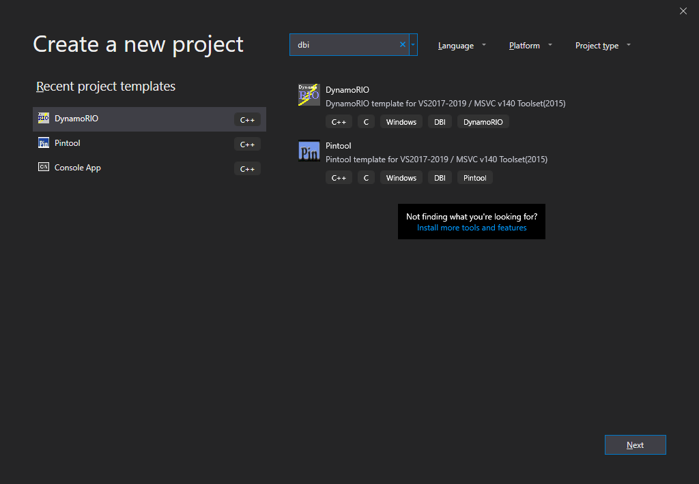

# DynamoRIOTemplate

DynamoRIOTemplate is a project template for [Visual Studio](https://visualstudio.microsoft.com/) 2017/2019, which helps you to make your **[DynamoRIO](https://www.dynamorio.org/)** based DBI tools easier, simply by using Visual Studio wizards.

## Requirements:
- Microsoft Visual C++
- **[DynamoRIO](https://www.dynamorio.org/)**

## Setup
After installing `MSVC` and DynamoRIO then set `DYNAMORIO_ROOT` to the location of your DynamoRIO installation (e.g., `C:\DynamoRIO-Windows-7.0.17886-0`). 

Finally copy the `DynamoRIOTemplate` directory to your Visual Studio template directory.

**Template Directory for VS 2019**

`"%userprofile%\Documents\Visual Studio 2019\Templates\ProjectTemplates\Visual C++ Project"`

**Template Directory for VS 2017**

`"%userprofile%\Documents\Visual Studio 2017\Templates\ProjectTemplates\Visual C++ Project"`

---

