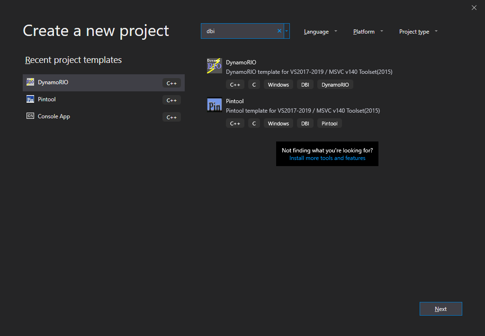

# PintoolTemplate

PintoolTemplate is a project template for [Visual Studio](https://visualstudio.microsoft.com/) 2017/2019, which helps you to make your **[Pintools](https://software.intel.com/en-us/articles/pin-a-dynamic-binary-instrumentation-tool)** easier, simply by using Visual Studio wizards.

## Requirements
- Microsoft Visual C++ (You must have `v140 toolset` and `SDK version 8.1` installed)
- **[Intel Pin](https://software.intel.com/en-us/articles/pin-a-dynamic-binary-instrumentation-tool)**

**Note:** It will work with `v141 toolset`, `v142 toolset` and the newer versions of Windows SDK, **but** in some cases I had some problems with them, so I prefer to use `v140 toolset` and `SDK version 8.1`. In your case it depends on you wheter using the `SDK 8.1` or newer versions, but if you want to use th `SDK version 8.1` note that `SDK 8.1` is gone from Visual Studio 2019 inslatter, so you must download and install it separately.

**[Download Windows SDK 8.1](https://developer.microsoft.com/en-us/windows/downloads/sdk-archive)**

## Setup
After installing `MSVC` and Intel Pin then set `PIN_ROOT` to the location of your Pin installation (e.g., `C:\pin-3.7-97619-g0d0c92f4f-msvc-windows`).

Finally copy the `PintoolTemplate` directory to your Visual Studio template directory.

**Template Directory for VS 2019**

`"%userprofile%\Documents\Visual Studio 2019\Templates\ProjectTemplates\Visual C++ Project"`

**Template Directory for VS 2017**

`"%userprofile%\Documents\Visual Studio 2017\Templates\ProjectTemplates\Visual C++ Project"`

---

